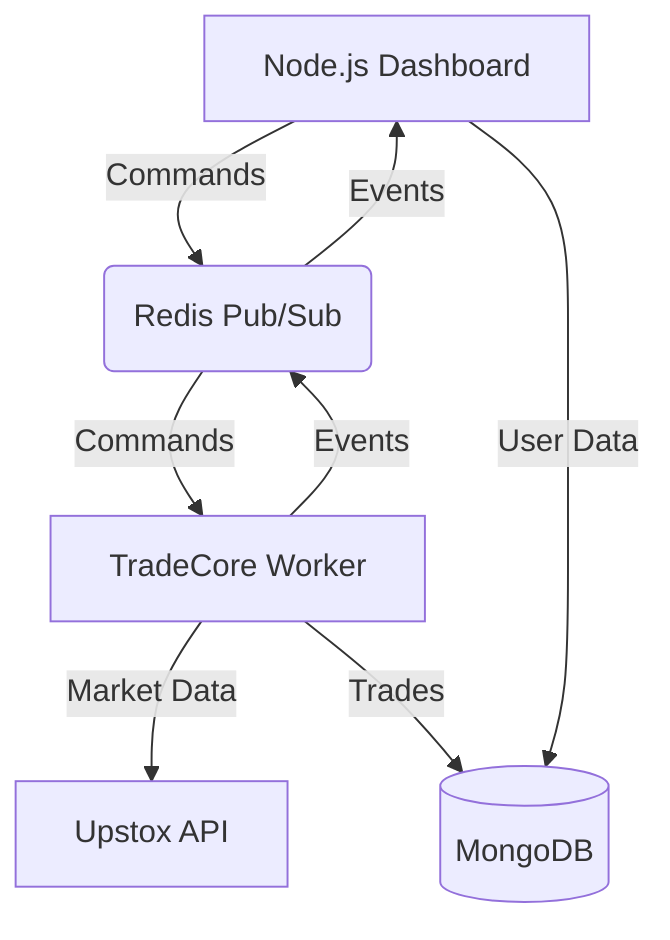

# Algo Execution Service

**TradeCore** is the high-performance algorithmic trading engine that powers the platform. It is built in Python and operates as a background worker service, handling market data analysis, signal generation, and trade execution.

It is designed to work in a **Hybrid Microservices Architecture**:
- **Node.js (Manager):** Handles User Dashboard, Authentication, and Settings.
- **TradeCore (Worker):** Handles Market Data, Technical Analysis, and Order Execution.
- **Redis:** Handles communication between Node.js and TradeCore.

## 🏗️ Architecture



## 📂 Project Structure

```
TradeCore/
├── app/
│   ├── __init__.py
│   ├── main.py              # Worker entry point (listens to Redis)
│   ├── config.py            # Configuration settings
│   ├── database.py          # MongoDB connection
│   ├── models/              # Pydantic models
│   │   └── trade.py         # Virtual trade model
│   ├── services/            # Business logic
│   │   ├── redis_manager.py      # Redis Pub/Sub handler
│   │   ├── trading_manager.py    # Manages user sessions
│   │   ├── websocket_client.py   # Upstox WebSocket connection
│   │   ├── protobuf_decoder.py   # Decodes Upstox binary data
│   │   └── trend_analyzer.py     # The "Brain" (Analysis + Execution)
│   └── utils/               # Utility functions
│       └── patterns.py      # Candlestick pattern recognition
└── requirements.txt         # Python dependencies
```

## 🚀 Features

- **Event-Driven:** Listens to Redis commands (`START_TRADING`, `STOP_TRADING`).
- **Real-Time Analysis:** Streams market data via WebSocket and analyzes trends instantly.
- **Scalping Strategy:** Implements EMA, RSI, SuperTrend, and Price Action logic.
- **Multi-User Ready:** Can manage multiple trading sessions concurrently.
- **Dual Mode:** Supports both **VIRTUAL** (Paper Trading) and **LIVE** execution.

## ⚙️ Setup

### 1. Prerequisites
- Python 3.9+
- Redis Server
- MongoDB

### 2. Install Dependencies
```bash
pip install -r requirements.txt
pip install grpcio-tools
```

### 3. Compile Protobuf
```bash
python -m grpc_tools.protoc -I=app/services --python_out=app/services app/services/MarketDataFeed.proto
```

### 4. Configure Environment
Create a `.env` file:
```env
MONGODB_URI=mongodb://localhost:27017
DATABASE_NAME=upstox_trading
REDIS_URL=redis://localhost:6379
```

### 5. Run TradeCore
```bash
python -m app.main
```
*You should see: "🎧 Waiting for commands on 'trading:commands'..."*

## 🔌 Communication Protocol

### Example Command (Redis)
Channel: `trading:commands`
```json
{
  "action": "START_TRADING",
  "user_id": "user_123",
  "data": {
    "access_token": "ey...",
    "strategy_config": { 
        "symbol": "BANKNIFTY",
        "trade_mode": "LIVE",
        "capital": 50000
    }
  }
}
```

## 📈 Trading Strategy

See [TRADING_STRATEGY.md](TRADING_STRATEGY.md) for a deep dive into the 4 pillars of analysis used by TradeCore.
